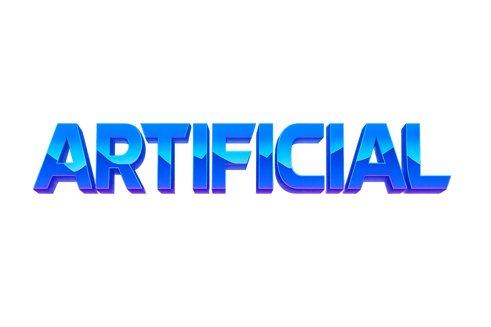

  

Artificial
==========

Artificial is a fast, skill‑based top‑down shooter — a spiritual successor to the Synthetik series — built for tight gunplay, crunchy feedback, and high replayability. It features active reloads, weapon jams, dashes, loot and crates, and a moddable content pipeline.

Highlights
----------

- Combat: active reload windows, jams/unjam, recoil and spread, pellet patterns, and satisfying audio/visual feedback.
- Progression: randomized stages with enemies, powerups, items, guns, and score review pages between areas.
- Movement: precise WASD with dash stocks and camera follow.
- Modding: Lua + hot‑reloadable assets; add guns, ammo, items, sprites, and sounds under `mods/`.
- Cross‑platform: C++20 + SDL2 + GLM; builds on Linux/macOS/Windows.

Quick Build & Run
-----------------

- Requirements: CMake 3.20+, a C++20 compiler, SDL2, GLM, Lua 5.4, SDL2_image, SDL2_ttf, SDL2_mixer.
- Linux (Debian/Ubuntu):
  - `bash scripts/setup_debian.sh`
  - `cmake --preset dev && cmake --build --preset dev -j`
  - `./build/artificial` (alias: `./build/arti`)
- Or use the helper script: `bash scripts/run.sh`

Windows/macOS
-------------

- Windows: use vcpkg for deps (SDL2, glm, lua, sdl2_image, sdl2_ttf, sdl2_mixer) and configure with the vcpkg toolchain file.
- macOS: install deps via Homebrew, then configure/build with CMake as above.

Modding
-------

- Drop content under `mods/<your_mod>/graphics|sounds|scripts`. Lua tables register guns, ammo, items, and crates; sprites and sounds are discovered by name.
- Asset changes hot‑reload during development.

More Info
---------

- Developer setup details: see `docs/dev_setup.md`.
- Technical overview (architecture, globals, modules): see `docs/tech_overview.md`.

