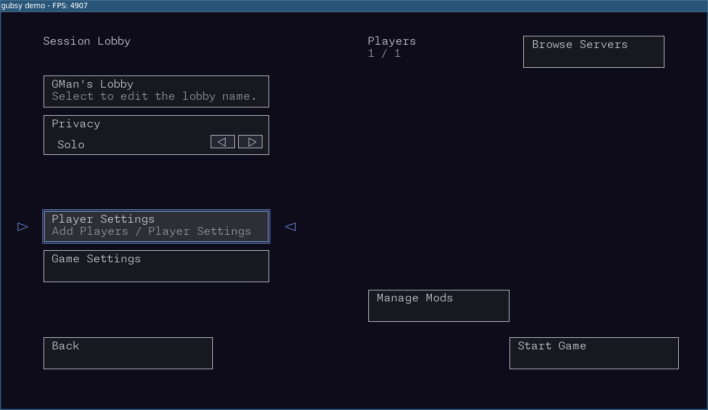

<p align="center">
  
</p>

gubsy
=====

`gubsy` is a small C++20 game kit/runtime with a bundled demo layer used to exercise the kit.
It currently includes SDL3 rendering, audio, input, menu systems, UI layout tooling, player/profile
state, and optional Lua-driven mod loading.

<p align="center">
  
</p>

What Is In This Repo
--------------------

- `include/gubsy/`: public headers used by games that import Gubsy
- `src/`: private implementation code, first-party modules, and generic built-in assets
- `demo/`: current bundled demo layer, shipped demo content, and built-in mods
- `tools/`: standalone servers and smoke-test binaries
- `data/`: writable runtime state for this game project
- `third_party/`: external dependency source vendored with the repo
- `imgui/`: Dear ImGui sources used by the engine
- `scripts/`: local build/run helpers

Current Game-Kit Features
-------------------------

- C++20 + CMake build
- SDL3-based windowing, rendering, image loading, fonts, and audio
- Input system for keyboard, mouse, and gamepad bindings
- Menu framework with screen registration, command routing, and per-screen state
- Player profiles, binds profiles, and game settings persistence
- UI layout loading/editing support
- Optional Lua 5.4 mod host with runtime API registration and mod activation/reload
- ImGui debug/editor tooling in the reusable runtime layer

Build
-----

Requirements:
- CMake 3.20+
- A C++20 compiler
- GLM, provided by `third_party/glm_upstream` or a system package
- Lua 5.4 dev headers for Gubsy developer/sample builds
- Optional system SDL3, SDL3_image, SDL3_ttf, and SDL3_mixer packages

Linux (Debian/Ubuntu):
- `bash scripts/setup_debian.sh`
- `bash scripts/build.sh`

Run:
- `./build/gubsy`
- or `bash scripts/run.sh`

The build also creates `./build/arti` as a symlink alias to `gubsy`.

Gubsy prefers system SDL3 packages when they are available, then falls back to
pinned SDL3 source builds through CMake `FetchContent`. Normal downstream game
consumers should link `gubsy::engine`; player-facing packaging belongs to the
game, not to Gubsy.

For a recorded local validation pass, use:

```bash
bash scripts/validate_local.sh all
```

The validation log records the host/toolchain versions needed for local
evidence without depending on GitHub-hosted package jobs.

The GitHub package workflow is manual-only and exists for remote platform
confidence. It is not the normal development feedback loop.

Using Gubsy From Another Project
--------------------------------

`gubsy` can be added as one dependency and linked through `gubsy::engine`:

```cmake
add_subdirectory(path/to/gubsy)
target_link_libraries(my_game PRIVATE gubsy::engine)
```

Public headers live under `include/gubsy/`:

```cpp
#include <gubsy/app.hpp>
#include <gubsy/run.hpp>
#include <gubsy/runtime.hpp>
```

The bundled sample and local tools are built by default only when `gubsy` is the
top-level CMake project. When imported as a subproject, they default off.

Runtime mod systems are opt-in for consumers:

```cpp
GubsyRuntime runtime{};
GubsyAppHooks hooks{};
hooks.config.enable_mods = false;
hooks.config.enable_mod_browser = false;
hooks.config.enable_mod_hot_reload = false;
hooks.config.enable_lua_mod_host = false;

do_the_gubsy(runtime, hooks);
```

The in-repo sample enables mods, the mod browser, hot reload, and Lua explicitly
to preserve the current demo behavior.

VS Code
-------

- Build task: `cmake: build (dev)`
- Run task: `run gubsy`
- F5 launch config: `Run gubsy (Debug, Linux)` or `Run gubsy (Debug, macOS)`

The workspace uses the `dev` CMake preset with strict warnings enabled. On GCC/Clang that includes
`-Wall -Wextra -Wpedantic`, plus additional warning flags and `-Werror`.

Formatting
----------

- The repo includes a top-level `.clang-format`
- VS Code is configured to use `clang-format`
- `compile_commands.json` is generated into `build/` by CMake

Project Layout Notes
--------------------

- The engine entrypoints live under `src/`
- The executable target is defined in `CMakeLists.txt` as `gubsy`
- The bundled demo layer registers modes, menus, binds, settings schemas, and mod APIs from `demo/main.cpp`

Docs
----

- Developer setup: `docs/dev_setup.md`
- CI/release policy: `docs/ci_release_policy.md`
- Engine roadmap: `docs/engine_roadmap.md`
- Engine 0.1 checklist: `docs/engine_0_1_checklist.md`
- Code-first engine intent: `docs/code_first_engine_intent.md`
- Repo layout: `docs/repo_layout.md`
- Content policy: `docs/content_policy.md`
- Library consumption: `docs/library_consumption.md`
- Gubsy game kit plan: `docs/game_kit_plan.md`
- Public API layout plan: `docs/public_api_layout_plan.md`
- Dependency packaging plan: `docs/dependency_packaging_plan.md`
- Engine/game split plan: `docs/engine_game_split_plan.md`
- Remove globals plan: `docs/remove_globals_plan.md`
- Cooperative multiplayer policy: `docs/cooperative_multiplayer_policy.md`
- Session contract: `docs/session_contract.md`
- Networking boundary: `docs/networking_boundary.md`
- Session browser flow: `docs/session_browser_flow.md`
- Steam onboarding TODO: `docs/steam_onboarding_todo.md`
- Menu system notes: `docs/menu.md`
- UI layout system notes: `docs/ui_layout_system.md`
- Mod/API notes: `docs/mod_api_system.md`
