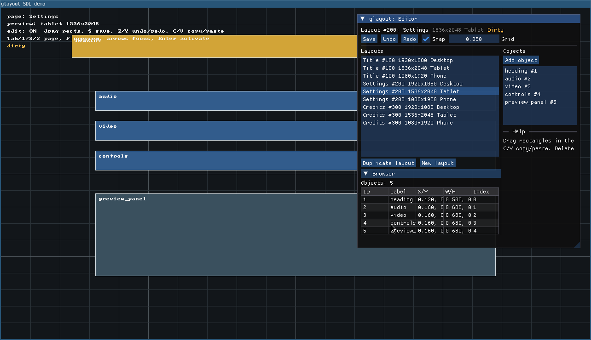

# glayout

<p>
  
</p>

`glayout` is a small C++20 library for storing, selecting, and editing 2D
rectangle layouts. It is meant for games and custom UI code that already has its
own renderer, input system, and widget behavior.

The library stores named/id'd rectangles in normalized coordinates. At runtime,
the host asks for the closest layout variant for a page id, resolution, and form
factor. Optional editor functions let a host move, resize, copy, paste, undo,
redo, and save those rectangles.

`glayout` is not a UI framework. It does not own widgets, rendering, input
routing, navigation, clipping, scrolling, styling, or the app loop. The host
decides what each rectangle means.

## Screenshot

<p>
  
</p>

## Targets

- `glayout::core`: layout structs, parsing/writing, layout matching, rectangle
  helpers, and renderer-free editor state/functions.
- `glayout::imgui`: optional Dear ImGui editor/browser helpers.

`glayout::core` depends on `gsexp::gsexp` for S-expression parsing. It has no
SDL, ImGui, engine, or renderer dependency.

## Add To A Project

The intended integration path is vendored source with CMake `add_subdirectory`.
Put `gsexp` and `glayout` somewhere under your project, for example:

```text
third_party/
  gsexp/
  glayout/
```

Then wire them into your CMake project:

```cmake
add_subdirectory(third_party/gsexp)

set(GLAYOUT_BUILD_EXAMPLES OFF CACHE BOOL "" FORCE)
set(GLAYOUT_BUILD_TESTS OFF CACHE BOOL "" FORCE)
set(GLAYOUT_BUILD_SDL_DEMO OFF CACHE BOOL "" FORCE)
add_subdirectory(third_party/glayout)

target_link_libraries(my_game PRIVATE glayout::core)
```

For sibling development checkouts, `glayout` defaults
`GLAYOUT_GSEXP_SOURCE_DIR` to `../gsexp`. If your layout is different, set it
before adding `glayout`:

```cmake
set(GLAYOUT_GSEXP_SOURCE_DIR "${CMAKE_SOURCE_DIR}/third_party/gsexp" CACHE PATH "" FORCE)
add_subdirectory(third_party/glayout)
```

## Dear ImGui

The ImGui helpers are optional. Enable them only if your project already uses
Dear ImGui or provides the ImGui source tree:

```cmake
set(GLAYOUT_WITH_IMGUI ON CACHE BOOL "" FORCE)
set(GLAYOUT_IMGUI_TARGET imgui CACHE STRING "" FORCE) # if your target is named imgui
add_subdirectory(third_party/glayout)

target_link_libraries(my_game PRIVATE glayout::imgui)
```

The ImGui editor accepts either a `std::vector<glayout::Layout>&` or a
`glayout::LayoutStore&`, so callers using the shared store do not need to expose
the raw vector unless they want to.

Accepted ImGui inputs are:

- `GLAYOUT_IMGUI_TARGET`: a CMake target name supplied by the caller.
- `imgui`: an existing CMake target.
- `ImGui::ImGui`: an existing package target.
- `GLAYOUT_IMGUI_SOURCE_DIR`: a path to an ImGui source checkout.

The development preset can fetch ImGui for the SDL demo, but that is only for
the demo build. Consumers should provide their own ImGui target or source tree.

## Basic Use

```cpp
glayout::LayoutStore store;
glayout::ParseResult parsed = store.load_file("layouts.lisp");

if (!parsed.ok) {
    // Print parsed.diagnostics.
}

const glayout::Layout* layout =
    store.find_best(title_page_id, render_width, render_height, glayout::FormFactor::Desktop);

if (layout) {
    const glayout::Object* play = glayout::find_object(*layout, "play");
    if (play) {
        glayout::Rect screen_rect = glayout::map_rect(
            glayout::Rect{0.0f, 0.0f, float(render_width), float(render_height)}, play->rect);
        // Draw or consume screen_rect in the host application.
    }
}
```

Editor use is explicit. The host gathers input, calls the editor once per frame,
draws the returned overlay data however it wants, and decides when to save.

```cpp
glayout::EditorState editor;
glayout::EditorInput input;
glayout::Layout& active_layout = layouts[active_layout_index];

glayout::editor_begin_frame(editor, active_layout, input, viewport);

for (const glayout::OverlayObject& object :
     glayout::editor_collect_overlay_objects(editor, active_layout, viewport)) {
    // Draw object.rect with your renderer.
}

if (editor.save_requested) {
    if (store.save_file(path))
        glayout::editor_mark_saved(editor);
}
```

`EditorState` is intentionally inspectable. Fields near the top are normal
caller-visible state/configuration. The lower bookkeeping fields are public for
debugging, but normal callers should let the editor functions update them.

## Build

```sh
./scripts/build.sh
```

The build script configures the default development preset and runs the core
tests through CTest.

## Demos

```sh
./scripts/run.sh
./scripts/run_sdl_demo.sh
```

The SDL demo shows normal consumption of `glayout::core`: layout lookup,
rectangle rendering, edit mode, grid/snap, undo/redo, save, and optional ImGui
panels. Controls are documented in
[examples/sdl_demo/README.md](examples/sdl_demo/README.md).

In VS Code, F5 launches the SDL demo on Linux with `cppdbg`/`gdb`. On macOS or
Windows, use your platform debugger config or run the demo script from a shell
after installing SDL3.

## File Format

Layouts are stored as small S-expression files:

```lisp
(ui_layouts
  (layout
    (id 100)
    (label "Title")
    (resolution (width 1920) (height 1080))
    (form_factor desktop)
    (objects
      (object (id 1) (label "play") (x 0.40) (y 0.40) (w 0.20) (h 0.08)))))
```

See [docs/spec.md](docs/spec.md) for design rules and responsibility
boundaries.
